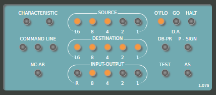
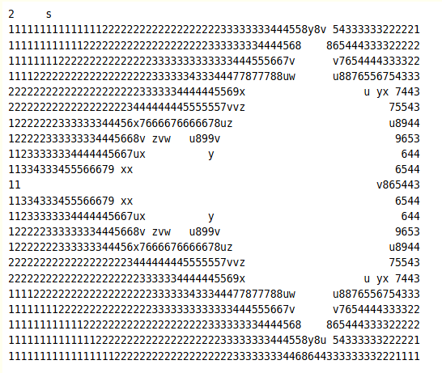
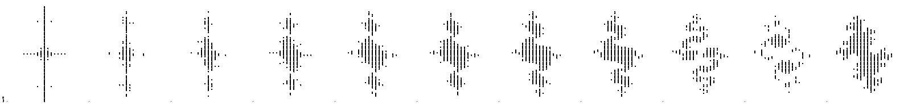
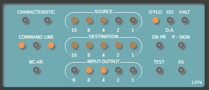
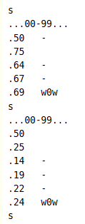

# Bendix G-15 Demo Instructions

Three demo programs prepared for display at the System Source museum.

## Overview

This demo tape contains three programs. Two generate and print out images of fractals, and the third is a number guessing game.

The fractal programs will run continuously without user interaction, the number guessing game requires typewriter input from the player.

With Compute set to OFF, load the tape and reset the machine.The G-15 will load the Number Track and a loader program. Switch Compute to GO and the remainder of the tape should load. The Mandelbrot program will now be running, awaiting user input.

## Programs

### Mandelbrot

Upon startup this program stops and waits for the user to select an image size appropriate for the paper loaded into the typewriter. The control panel should look like this:

To select a size type `N[TAB]s` where N is one of 0,1,2 or 3. These are the smallest through largest sizes.

TODO: Table of size and time estimate for each option.

Typeout will begin. There is a BREAKPOINT after each complete image, after which the image will begin printing again at the same size. This allows the program to either be run in repeat mode hands off (by setting Compute to GO) or to draw a single image and then stop (by setting Compute to BP).

To select a different size see the *Changing Programs* instructions to restart the Mandelbrot Program

#### Simulated Output:

### Julia Set

This program prints a number of iterations of the Julia set with different parameters.

There are no options.

The program will print out a number of different images before encountering a BREAKPOINT, after which it will restart from the beginning.

Note that this program prints out large spans of white space, and then the letter `x`. Before each image it prints a single period. If we ever run it for real this period is to enable registration of scanned images so that an animation can be created.

#### Simulated Output:

(This is an image of several **feet** of print-out, turned sideways)

### Number Guessing Game

The G-15 chooses a number from 0-100, and the player tries to guess that number. The G-15 gives hints, too low, too high, or WOW! You guessed it, after each guess.

To play:

Once the game is selected and started the front panel ligts will be flickering furiously, looking like the following image, as the G-15 thinks of different random numbers:

To start the game hit the `s` key.

The G-15 will tell you it is thinking of a number from `...00-99...`. It will then print a newline and a period to indicate that it wants you to enter your guess. Enter a **two digit** number (`07` not `7`) and hit `[TAB]`.

If your guess is too LOW the G-15 will ding once and print a minus sign `-`.
If your guess is too HIGH the G-15 will ding twice, and ask for another guess.
If you guess correctly the G-15 will say `w0w` in celebration and ding three times!

(If you enter a 1 digit number by mistake, hit tab 4 more times, and it will ask for a new guess)

After you win the game you can press `s` to start another game.

Simulated Output:

## Changing Programs

To change to a different program, or restart a program...

1. Set Compute to OFF.
2. Set Enable to ON.
3. Type one of the following:
   * Mandelbrot: `scf0`
   * Julia Set: `scf3`
   * Guessing Game: `scf5`
4. Set Enable to OFF.
5. Set Compute to GO (or BP as appropriate).

## Credit:

* Complex Multiplication Subroutine prepared by D. Stein & S. H. Lewis, March 1957
  * Transcription and typo fixes by David Green
* Bendix G-15 Restoration & Operation: David Lovett, 2025
* Mandelbrot, Julia & Guessing Game prepared by Wm. Kuker, 2025

The fractal programs were inspired when I found the scanned listings of the complex math subroutines from 1957. The first Mandelbrot set was computed and typed out by Robert W. Brooks and Peter Matelski in 1978. On September 9th, 2025 David Lovett executed this algorithm for the first time on Bendix G-15 SN: 369. As far as we know this was the first ever computation of the Mandelbrot set on a vacuum tube computer.